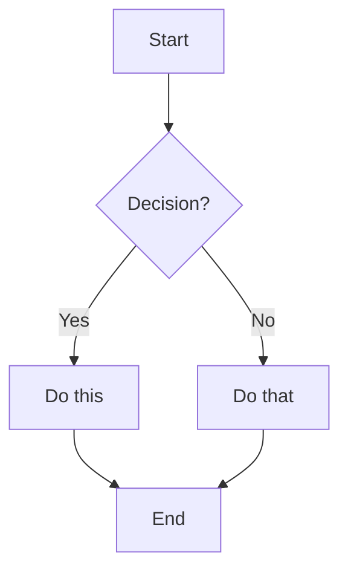
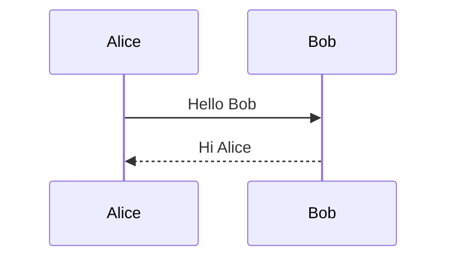

# Marp Passthrough Test — Page 1

このページは **基本のテキスト装飾** を確認する。

- 強調: **太字** / *斜体* / ~~取消線~~ / `inline code`
- リンク: [Marp 公式](https://marp.app/)
- 引用: 下の blockquote

> これは blockquote。複数行に対応するか。
> 2 行目。

水平線（hr ではなく単なる`***`）:

***

末尾の水平線が出るかは theme 依存。

---

# Page 2 — リスト

## 順序なしリスト

- 項目 A
  - ネスト A-1
  - ネスト A-2
    - 深いネスト A-2-1
- 項目 B

## 順序付きリスト

1. 第一
2. 第二
   1. ネスト 2-1
3. 第三

## タスクリスト

- [x] 完了タスク
- [ ] 未完了タスク
- [ ] もう 1 個未完了

---

# Page 3 — テーブル

基本テーブル + alignment 指定:

| 左寄せ | 中央 | 右寄せ |
|:---|:---:|---:|
| A | B | C |
| 長い文字列 | x | 1,234 |
| 短 | yes | 5 |

---

# Page 4 — コードブロック

JavaScript の syntax highlight:

```js
function fibonacci(n) {
  if (n <= 1) return n
  return fibonacci(n - 1) + fibonacci(n - 2)
}

const result = fibonacci(10)
console.log(result) // 55
```

TypeScript:

```ts
interface User {
  id: string
  name: string
  age?: number
}

const user: User = { id: 'a1', name: 'Aki' }
```

言語指定なし:

```
plain text block
no highlighting
```

---

# Page 5 — Math (KaTeX)

インライン数式: $E = mc^2$ が表示されるか。

ブロック数式:

$$
\int_{-\infty}^{\infty} e^{-x^2} \, dx = \sqrt{\pi}
$$

行列:

$$
A = \begin{pmatrix}
a & b \\
c & d
\end{pmatrix}
$$

---

# Page 6 — Mermaid



シーケンス図:



---

<!-- _class: invert -->

# Page 7 — Marp Directives

このページは **`<!-- _class: invert -->`** を指定。default テーマには invert クラスがあるが、whitepaper-a4 では効くか不明。

---

<!-- _header: '**Test Header**' -->
<!-- _footer: 'Test Footer / Page 8' -->

# Page 8 — Header / Footer Directives

`_header` / `_footer` で個別ページにヘッダフッタ追加。

---

<!-- _backgroundColor: '#f0f8ff' -->

# Page 9 — Background Color

`_backgroundColor` でページ背景色変更。

---

# Page 10 — HTML 埋込

<div style="color: red; font-weight: bold;">これは HTML 直書き。html: true じゃないと素通しされない。</div>

下に `<br>` 改行:

行 1<br>行 2

---

# Page 11 — 画像

外部 URL:


サイズ指定（Marp 拡張）:


`bg` directive で背景画像:

---


# Page 12 — Background Image

`![bg]` でページ背景に画像。

---

# Page 13 — Footnote

これは脚注付きの文章[^1]。複数も可能[^2]。

[^1]: 脚注 1 の内容
[^2]: 脚注 2 の内容

---

<!-- _color: '#cc0000' -->

# Page 14 — `_color` Directive

このページはテキスト色を **赤** に。`_color: '#cc0000'` で指定。

本文も色付け対象になるはず。

---

<!-- _paginate: false -->

# Page 15 — `_paginate: false`

このページだけページ番号を消す。前後のページは番号が付くはず。

A2 / 検証点: 個別ページの paginate 制御が効くか。

---

# Page 16 — 画像 filter（Marp 拡張）

通常画像:


グレースケール:


ブラー:


セピア:


回転 + 拡大:


---


# Page 17 — `![bg right]` 右側分割背景

`![bg right]` で右半分に背景画像、左にコンテンツの 2 列レイアウト。

- 項目 A
- 項目 B
- 項目 C

これは Marp 拡張の split background。

---


# Page 18 — `![bg left:33%]` 左側 33% 分割

左 33% に背景、右 67% に本文。比率指定。

A2 / 検証点: 比率指定が効くか。

---


# Page 19 — `![bg vertical]` 縦並び背景

複数の background image を縦に並べる。Marp 拡張。

---

# Page 20 — Speaker notes

これは通常本文。

<!-- このコメントは speaker notes として認識されるはず。
PDF 出力時に annotation として埋め込まれる（--pdf-notes フラグで）。
HTML 出力時には bespoke template で presenter view から見える。 -->

speaker note 検証点:
- HTML 出力で speaker note が data 属性等で残るか
- PDF 出力（`--pdf-notes` 無し）では含まれないはず

---

<!-- _backgroundImage: 'linear-gradient(to right, #ff0000, #0000ff)' -->

# Page 21 — `_backgroundImage` Directive

このページは gradient 背景。`_backgroundImage` で CSS background-image 風に指定。

A2 / 検証点: directive 経由の背景画像が効くか。
